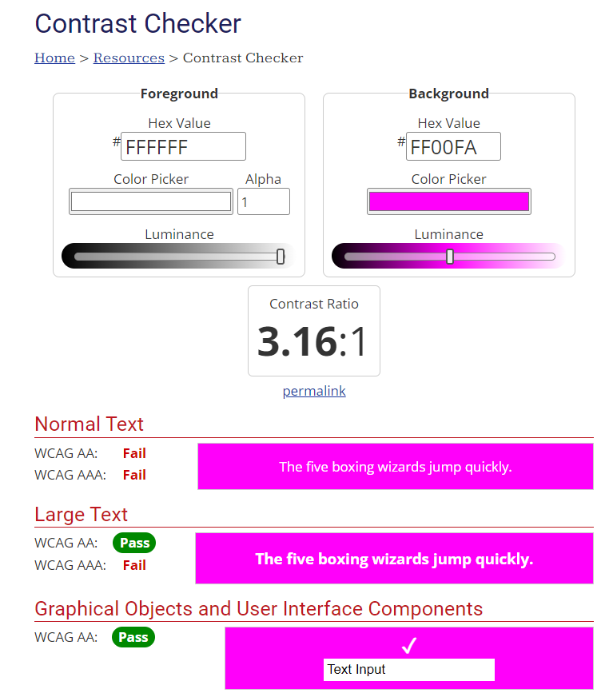
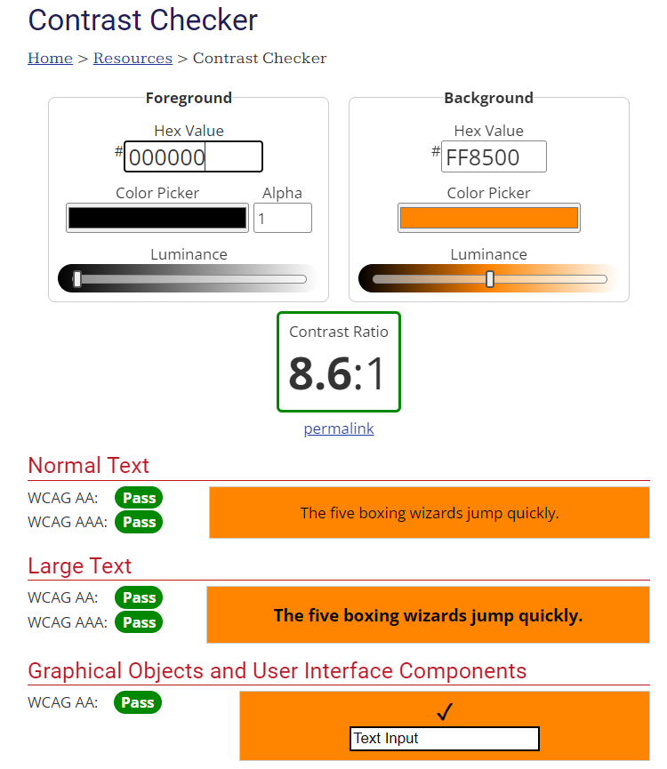
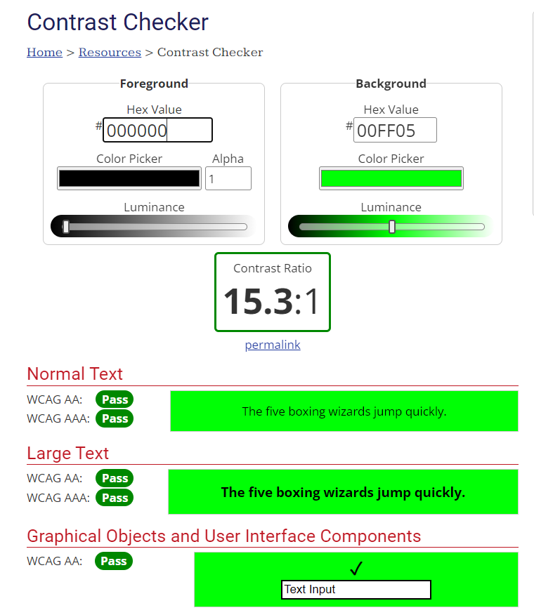
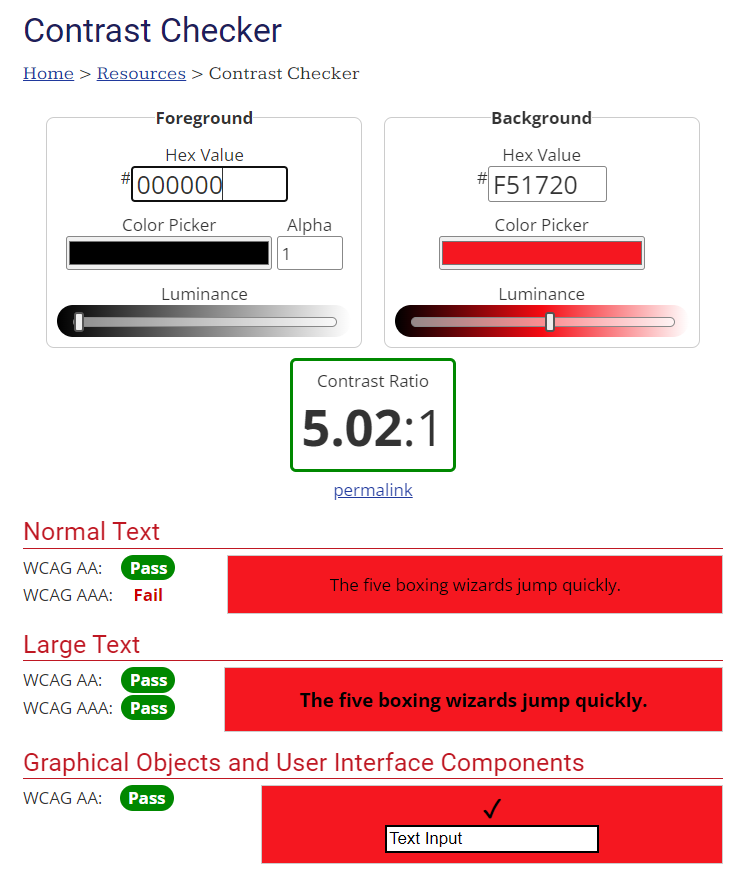

# Famous Places 
[View my live site here](https://abigail-ryan.github.io/famous-places/)

Famous Places is an online interactive quiz for teens and adults to test their knowledge of famous landmarks throughout the world.
Users of this site can play the multiple- choice quiz, with immediate feedback, and view their scores at the end.

## Contents
* [User Stories](#user-stories)
  * [Primary Goal](#primary-goal)
  * [Visitor Goals](#visitor-goals)
  * [New User](#new-user)
  * [Site Admin](#site-admin)
* [UX Design](#ux-design)
  * [Strategy](#strategy)
  *	[Scope](#scope)
  * [Structure](#structure)
  * [Skeleton](#skeleton)
    * [Wireframes](#wireframes)
  * [Surface](#surface)
* [Design](#design)
  * [Color Scheme](#color-scheme)
  * [Typography](#typography)
  * [Imagery](#imagery)
* [Page Features](#page-features)
  * [Desktop View](#desktop-view)
    * [Header](#header)
    * [Hero image](#hero-image)
    * [Game Rules](#game-rules)
    * [CTA](#cta)
    * [Footer](#footer)
    * [Quiz Layout](#quiz-layout)
    * [Quiz Results](#quiz-results)
  * [Tablet and Mobile View](#tablet-and-mobile-view)
    * [Tablet View](#tablet-view)
    * [Mobile view](#mobile-view)
 * [Future Features](#future-features)
 * [Technologies Used](#technologies-used)
   * [Languages](#languages)
   * [Frameworks, Libraries, Technologies and Programs used](#frameworks-libraries-technologies-and-programs-used)
* [Testing](#testing)
  * [Manual Testing](#manual-testing)
  * [HTML Validation using W3C Validation](#html-validation-using-w3c-validation)
    * [Index page](#index-page)
    * [Quiz page](#quiz-page)
  * [CSS Validation using W3C Validation](#css-validation-using-w3c-validation) 
  * [Lighthouse scores using Chrome Dev Tools](#lighthouse-scores-using-chrome-dev-tools)
    * [Desktop](#desktop) 
    * [Mobile](#mobile)
   * [Bugs](#bugs)
* [Deployment](#deployment) 
* [Forking the GitHub Repository](#forking-the-github-repository)
* [Clone the GitHub Repository](#clone-the-github-repository)
* [Credits](#credits)
  * [Content and Code References](#content-and-code-references)
  * [Media References](#media-references)
* [Acknowledgements](#acknowledgements)     
         
 
___

### User Stories
#### Primary Goal

The goal is to create an interactive online quiz for teens and adults, based on famous landmarks throughout the world. 

#### Visitor Goals

Visitors to Famous Places will be able to take part in a general knowledge quiz and see in real time if they got the correct answers. They will also be able to view their final score and have a chance to take the quiz again.

#### New User

* A new user can easily identify what the quiz is about.
* A new user can understand the quiz rules.
* A new user can start the quiz when they are ready.
* A new user can see what question number they are on.
* A new user can immediately see if their answer is correct/incorrect.
* A new user can easily navigate through the quiz.
* A new user can view their final score.
* A new user can start the quiz over again.

#### Site Admin

* I want to give users a fun experience testing their knowledge of landmarks around the world.

___

### UX Design

#### Strategy

* The Famous Places quiz needs to be fun, bright and interactive. The design must be simple but effective in displaying to the user that this is an online quiz game.
* The quiz needs to be started when the user is ready.
* Navigating through this quiz needs to be easy for the player.
*	The final score must be displayed to the player.
*	All text must be clear and legible on all device sizes. 
* Full responsiveness for all screen sizes is essential for this website.

#### Scope

*	The landing page should display the game rules. 
*	A “start” button will allow users to start the quiz when they are ready.
*	Once selected, the player will not be able to change their answer.
*	After an answer has been selected the “next” button will display to take the player to the next question.
*	The game will record the players correct answers.
*	When the quiz is finished, feedback to the player showing their score will be displayed.
*	A “play again” button will be displayed to allow the user to play the game again.

#### Structure

*	A large heading with the game name “Famous Places” will be at the top of the page.
*	A clear and short introduction to the game rules will be displayed to the user, to inform them how to play.
*	A clear call to action “start” button will be displayed underneath the rules to prompt the player to start the game.
*	The game will display large images with a question and multiple choice answers to test the players knowledge.
*	The answer buttons on the site must provide feedback to the player, in the form of a colour change to green for correct, and red for incorrect.
*	The next button will take the player to the next question.
*	The player will be informed of their score once all questions have been answered, with an option to play the game again.

#### Skeleton

*	The layout and design of the quiz must be clean, and very minimal to avoid distraction.
*	Upon loading, the landing page will display a large heading.
*	Below that, a short description of the game rules, with a start button underneath allowing the player to start the quiz when ready. This will be displayed on a ‘tile’ background that is centred on the page.
*	The player will be taken to the first question, which will have a large image of a famous monument/building, along with a question, and 4 possible answers. This will be displayed on a ‘tile’ that is centred on the page.
*	The “next” button will be displayed after the player selects an answer.
*	The results page will show the player a tally of their score. Again this will be displayed again on a ‘tile’ background that is centred on the page.

#### Wireframes

Mobile

 

Desktop

 

From wireframe concept to final product

 

The overall design for my quiz has mostly remained the same as my wireframe layout, with some slight changes as mentioned below:

Mobile view:
* The answer buttons are stacked in a column for mobile devices to allow enough room for longer answers.

Mobile & Desktop view:
* The game rules have been placed in a modal pop up, underneath the start image. This allows room for the short paragraph instructing the user to input their username.
* An input field has been added on the start modal for the player to input their name before starting the quiz. This is optional.
* The players name is used to give personalisation on the results page. If the player doesn’t input their name on the start page, the default “Player 1” will be displayed on the results window.
* I added a feedback statement based on the users results; giving encouragement to try again for low scores, and congratulations for high scores
* An exit quiz button was added to allow players to exit out of the quiz loop back to the start window.

#### Surface 

* It was important to keep the design of the quiz clean and fresh.
* The background ‘tiles’ were kept white, to allow the images stand out and be the focus.
* The answer buttons were styled with pops of color inspired by the background image, for a bring fun feel for the game. 
* The player receives immediate feedback on their answers. The selected button changes color to indicate correct or incorrect answers. 
* The player recieves their final score at the end of the quiz, with a feedback message depending on their score level.
* The player has the option to play the quiz again or exit back to the start screen.

___

### Design
#### Color Scheme

With the idea to keep the design clean and fresh I chose my color pallete based on the images I had sourced for my questions. As my questions imagery has quite a strong blue presence, I chose bright contrasting colors similar to the background question-mark image. I also chose a vibrant green for indicating the correct answer, as well as a strong red to indicate incorrect answers.

I tested these colours out in Uizard to see a how I liked the color pairing.

Color pairing test

 

 
I also ran my colour pairings through Contrast Checker to check for color contrast accessibility issues. I had initially wanted to use white text within all my buttons however this returned all fails for the answers buttons color. So I decided to use black text throughout the entire quiz, apart from the “start”, “next”  and “play again” buttons, as these passed the contrast checker for large text, and so I ensured these buttons were large with a high font weight to make the text bold.

Color Contrast Checker

 

