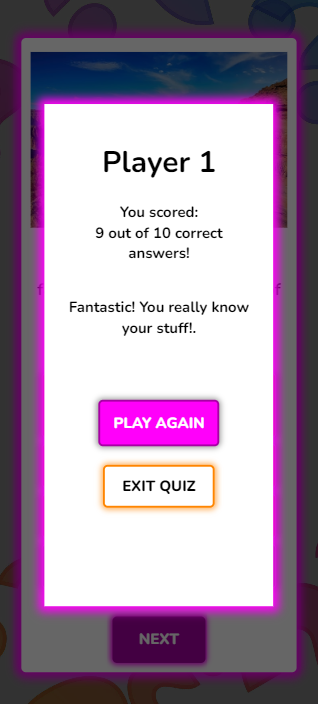

# Famous Places 
[View my live site here](https://abigail-ryan.github.io/famous-places/)

Famous Places is an online interactive quiz for teens and adults to test their knowledge of famous landmarks throughout the world.
Users of this site can play the multiple- choice quiz, with immediate feedback, and view their scores at the end.

## Contents
* [User Stories](#user-stories)
  * [Primary Goal](#primary-goal)
  * [Visitor Goals](#visitor-goals)
  * [New User](#new-user)
  * [Site Admin](#site-admin)
* [UX Design](#ux-design)
  * [Strategy](#strategy)
  *	[Scope](#scope)
  * [Structure](#structure)
  * [Skeleton](#skeleton)
    * [Wireframes](#wireframes)
  * [Surface](#surface)
* [Design](#design)
  * [Color Scheme](#color-scheme)
  * [Typography](#typography)
  * [Imagery](#imagery)
* [Page Features](#page-features)
  * [Desktop View](#desktop-view)
    * [Start Modal](#start-modal)
    * [Game Rules](#game-rules)
    * [Quiz Layout](#quiz-layout)
    * [Answer Feedback](#answer-feedback)
    * [Quiz Results](#quiz-results)
  * [Mobile View](#mobile-view)
    * [Mobile view](#mobile-view)
 * [Future Features](#future-features)
 * [Technologies Used](#technologies-used)
   * [Languages](#languages)
   * [Frameworks, Libraries, Technologies and Programs used](#frameworks-libraries-technologies-and-programs-used)
* [Testing](#testing)
  * [Manual Testing](#manual-testing)
  * [Validation and Lighthouse Testing](#validation-and-lighthouse-testing)
* [Deployment](#deployment) 
* [Forking the GitHub Repository](#forking-the-github-repository)
* [Clone the GitHub Repository](#clone-the-github-repository)
* [Credits](#credits)
  * [Content and Code References](#content-and-code-references)
  * [Media References](#media-references)
* [Acknowledgements](#acknowledgements)     
         
 
___

### User Stories
#### Primary Goal

The goal is to create an interactive online quiz for teens and adults, based on famous landmarks throughout the world. 

#### Visitor Goals

Visitors to Famous Places will be able to take part in a general knowledge quiz and see in real time if they got the correct answers. They will also be able to view their final score and have a chance to take the quiz again.

#### New User

* A new user can easily identify what the quiz is about.
* A new user can understand the quiz rules.
* A new user can start the quiz when they are ready.
* A new user can see what question number they are on.
* A new user can immediately see if their answer is correct/incorrect.
* A new user can easily navigate through the quiz.
* A new user can view their final score.
* A new user can start the quiz over again.

#### Site Admin

* I want to give users a fun experience testing their knowledge of landmarks around the world.

___

### UX Design

#### Strategy

* The Famous Places quiz needs to be fun, bright and interactive. The design must be simple but effective in displaying to the user that this is an online quiz game.
* The quiz needs to be started when the user is ready.
* Navigating through this quiz needs to be easy for the player.
*	The final score must be displayed to the player.
*	All text must be clear and legible on all device sizes. 
* Full responsiveness for all screen sizes is essential for this website.

#### Scope

*	The landing page should display the game rules. 
*	A “start” button will allow users to start the quiz when they are ready.
*	Once selected, the player will not be able to change their answer.
*	After an answer has been selected the “next” button will display to take the player to the next question.
*	The game will record the players correct answers.
*	When the quiz is finished, feedback to the player showing their score will be displayed.
*	A “play again” button will be displayed to allow the user to play the game again.

#### Structure

*	A large heading with the game name “Famous Places” will be at the top of the page.
*	A clear and short introduction to the game rules will be displayed to the user, to inform them how to play.
*	A clear call to action “start” button will be displayed underneath the rules to prompt the player to start the game.
*	The game will display large images with a question and multiple choice answers to test the players knowledge.
*	The answer buttons on the site must provide feedback to the player, in the form of a colour change to green for correct, and red for incorrect.
*	The next button will take the player to the next question.
*	The player will be informed of their score once all questions have been answered, with an option to play the game again.

#### Skeleton

*	The layout and design of the quiz must be clean, and very minimal to avoid distraction.
*	Upon loading, the landing page will display a large heading.
*	Below that, a short description of the game rules, with a start button underneath allowing the player to start the quiz when ready. This will be displayed on a ‘tile’ background that is centred on the page.
*	The player will be taken to the first question, which will have a large image of a famous monument/building, along with a question, and 4 possible answers. This will be displayed on a ‘tile’ that is centred on the page.
*	The “next” button will be displayed after the player selects an answer.
*	The results page will show the player a tally of their score. Again this will be displayed again on a ‘tile’ background that is centred on the page.

#### Wireframes

Mobile

 

Desktop

 

From wireframe concept to final product

 

The overall design for my quiz has mostly remained the same as my wireframe layout, with some slight changes as mentioned below:

Mobile view:
* The answer buttons are stacked in a column for mobile devices to allow enough room for longer answers.

Mobile & Desktop view:
* The game rules have been placed in a modal pop up, underneath the start image. This allows room for the short paragraph instructing the user to input their username.
* An input field has been added on the start modal for the player to input their name before starting the quiz. This is optional.
* The players name is used to give personalisation on the results page. If the player doesn’t input their name on the start page, the default “Player 1” will be displayed on the results window.
* I added a feedback statement based on the users results; giving encouragement to try again for low scores, and congratulations for high scores
* An exit quiz button was added to allow players to exit out of the quiz loop back to the start window.

#### Surface 

* It was important to keep the design of the quiz clean and fresh.
* The background ‘tiles’ were kept white, to allow the images stand out and be the focus.
* The answer buttons were styled with pops of color inspired by the background image, for a bring fun feel for the game. 
* The player receives immediate feedback on their answers. The selected button changes color to indicate correct or incorrect answers. 
* The player recieves their final score at the end of the quiz, with a feedback message depending on their score level.
* The player has the option to play the quiz again or exit back to the start screen.

___

### Design
#### Color Scheme

With the idea to keep the design clean and fresh I chose my color pallete based on the images I had sourced for my questions. As my questions imagery has quite a strong blue presence, I chose bright contrasting colors similar to the background question-mark image. I also chose a vibrant green for indicating the correct answer, as well as a strong red to indicate incorrect answers.

Color Palette Inspo

 

The background was darkened to allow the full focus to be on the question and images within the quiz.

 
I tested these colours out in Uizard to see a how I liked the color pairing.

Uizard Color pairing test

 

Aditional colors

 
I used the following colors to add more life to the buttons in the form of borders, box shadows and hover effects.

 
I also ran my colour pairings through Contrast Checker to check for color contrast accessibility issues. I had initially wanted to use white text within all my buttons however this returned all fails for the answers buttons color. So I decided to use black text throughout the entire quiz, apart from the “start”, “next”  and “play again” buttons, as these passed the contrast checker for large text, and so I ensured these buttons were large with a high font weight to make the text bold.

Color Contrast Checker

 

#### Typography

I used Font Joy to search for a font pairing that I liked. I chose to use only one font, “Nunito”, across the entire site as I liked the fun character to the lettering, and felt it suited the overall feel of the quiz. I used Google Fonts to import this. 

#### Imagery

It was important to me that the imagery used within the quiz was very vibrant and had strong colors, as I wanted to create a clean look to body of the quiz, while the focus and attention was on the images and quiz questions. 

All images used throughout Famous Places were sourced from pixabay.com, unsplash.com and freepik.com. Attributions to each photographer and source are placed in the Credits section of this README.

___

### Page Features

#### Desktop View
##### Start Modal

The start modal displays the game name, along with a tagline "A quiz around the world!" to inform the user what this game is about. A colorful image of a collage of famous monuments, some of which feature in the Famous Places quiz, is also displayed here. The game rules are contained within a pop out modal, and underneath that, the user is instructed to input their name(optional) before starting the game. 

The game cannot be started until the user clicks the start button.

##### Game Rules 

The game rules modal pops out when the user clicks the view game rules button. The game rules are explained, and the user then has to click the "x" in the top right hand corner to exit the rules modal. This modal cannot be closed by clicking anywhere else on the screen.

##### Quiz Layout

Once the player clicks the start button, they are presented with the first question (shuffled randomly for each new game). The quiz includes a large image of a famous place in the world, along with a question, and four possible answers. The questions include some interesting facts and general knowledge, and vary in difficulty. Only after the player selects an aswer, the "next" button appears allowing the player move to the next question.

##### Answer Feedback

The player recieves immediate feedback if they got the correct or incorrect answer. Once selected, the player is not able to change their answer. To encourage the players to play the quiz again I chose not to include highlighting the correct answer when the user gets it wrong. This way, for more difficult questions or when the player has no clue what the answer is, it will encourage them to play again to find out the correct answer and beat their previous score. 

##### Quiz Results

When the player reaches the end of the quiz, they are presented with their results. If the player did not input their name at the start, the results show the default "Player 1", and if they did the result page is personalised. This is followed by their score out of 10 correct answers, and a message based on their score level. The player then has the option to play the game again, which will keep their name/default name, and take them to the first question. If the user exits the quiz, they are brough back to the start modal.

#### Mobile View

Mobile View

 

| Start Modal | Game Rules | Quiz Layout |
| ---| ---| ---|
|  |  |  | 

| Incorrect Answer | Correct Answer | 
| ---| ---|
|  |  |

| Results - Default Name | Results - Personalised Name |
| ---| ---|
|  |  |

___

### Future Features

With more learning and understanding of JavaScript, for future development of this project I would like to add:
* A high scores feature, that shows the current users a list of their high scores based on their current game attempts.
* A timer function so users can see their time taken to complete the quiz. 
* A results percentage display, inspired by this tutorial from [Codehal](https://www.youtube.com/watch?v=Vp8x8-reqZA). (_I did want to, and tried to, include this particular feature in the current version of this project, however it is outside my scope of learning at the moment and I was unable to make the code work in my project. It is a feature I will work to understand and include in future versions._)
* A much larger selection of questions so that the quiz is vastly different every time the game is played.
* A difficulty level where players race against the clock to get the answers right before running out of time.

___

### Technologies Used
#### Languages
* HTML
* CSS
* JavaScript

#### Frameworks, Libraries, Technologies and Programs Used

* Uizard - used to create wireframes and view colour scheme
*	Git - used for version control
*	GitHub - used to save and store all files for this website
*	Google Fonts – used to import the font for this site
*	Canva Colour – used for colour palette creation
*	Favicon.io – for the globe favicon
*	Tiny PNG - used to compress images
* WebAim Contrast Checker - for checking my colour contrasts for this site
*	Google Dev Tools – used to test responsiveness and to debug
*	Google Lighthouse - for testing overall performance and accessibility of the site
*	W3C Validator - for validating my HTML and CSS code
* JSHint - for validating my JavaScript code

___

### Testing
#### Manual Testing

The browsers used were:
*	Chrome
*	Opera
*	Microsoft Edge
*	Safari

I deployed my site early in the development process to test on real-world devices and continued testing throughout. These devices user were:
* Acer Aspire F 15 Laptop
*	Realme 11 Pro+ phone
*	Huawei P20 Pro phone
*	Apple iPad 2018

The results of feature testing are as follows:

#### Validation and Lightouse Testing

HTML Validation

 

CSS Validation

 

JavaScript Validation

 

Lighthouse Testing - Desktop Score

 

Lighthouse Testing - Mobile Score

 

___